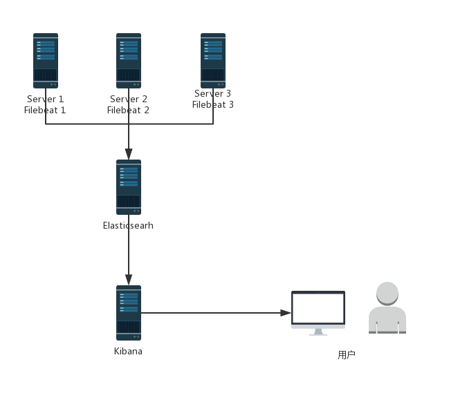

### 一、什么是EFK
EFK是ELK的变种，主要是将日志进行聚合，方便查询。  
EFK不是一个软件，而是一系列工具的组合(一种问题的解决方案)，来解决传统方式查询日志繁琐、低效的问题。  
EFK是将ELK中的Logstash替换成Filebeat，两者对比如下  
| 对比 | 优势 | 劣势 | 备注 |
| :--------: | ----------- | -------- | -------- |
| Logstash | 灵活度高<br>插件多<br>处理问题范围广 | 与其他替代品对比性能低<br> 资源占用高(默认堆为1GB)<br>不支持缓存 | Redis或Kafka作为中心缓存池|
| Filebeat | 资源占用低<br>可靠性高<br>性能高<br>日志过滤(5.x)  | 应用范围小<br>只支持将日志发送到ES、Logstash、redis(5.x)和kafka(5.x) | 一般选择Kafka作为下游管道，<br>如果选择Logstash还是会出现性能和资源消耗问题|
### 二、EFK具体组成
E：Elasticsearch - 数据存储、搜索、分析  
Elasticsearch是个开源分布式搜索引擎，提供搜集、分析、存储数据三大功能。它的特点有：分布式，零配置，自动发现，索引自动分片，索引副本机制，restful风格接口，多数据源，自动搜索负载等。  
F：Filebeat - 数据搜集  
K：Kibana - 数据展示  
**最简单的EFK架构图**  

### 三、搭建步骤
#### 1、ES安装
因为ES需要java运行环境（Java 8 及以上），所以先要安装Java 8 下载地址，下载完成后，使用工具上传到服务器
```html
https://download.oracle.com/otn-pub/java/jdk/8u201-b09/42970487e3af4f5aa5bca3f542482c60/jdk-8u201-linux-x64.tar.gz
```
解压
```shell
tar -zxvf jdk-8u201-linux-x64.tar.gz
```
修改系统环境变量
```shell
vi /etc/profile
```
在文件末尾加上如下内容
```html
JAVA_HOME=/usr/java/jdk1.8.0_181/
JRE_HOME=$JAVA_HOME/jre
CLASS_PATH=.:$JAVA_HOME/lib/dt.jar:$JAVA_HOME/lib/tools.jar:$JRE_HOME/lib
PATH=$PATH:$JAVA_HOME/bin:$JRE_HOME/bin
export JAVA_HOME JRE_HOME CLASS_PATH PATH
```
其中JAVA_HOME后面的路径替换为自己jdk的解压路径  
按下ESC键进入命令行模式，输入以下代码,保存并退出
```shell
:wq
```
让刚刚配置的环境变量生效
```shell
source /etc/profile
```
检验jdk是否安装成功
```shell
java -version
```
出现版本号信息则表示安装成功

下载ES，这里使用的版本为6.6.1，注意ES、Filebeat以及Kibana必须使用相同的版本
```shell
wget https://artifacts.elastic.co/downloads/elasticsearch/elasticsearch-6.6.1.tar.gz
```
解压
```shell
tar -zxvf elasticsearch-6.6.1.tar.gz
```
进入ES根目录，修改配置文件
```shell
vi config/elasticsearch.yml
```
修改为以下参数
```json
network.host: 0.0.0.0
http.port: 9200
```
Elasticsearch不能使用root用户打开，所以需要额外的一个用户来启动它
```shell
adduser elastic
#设置密码（需要输入两次）
passwd 123456789
#设置文件夹权限
chmod -R 777 /usr/efk/es/elasticsearch-6.6.1
#切换用户
su elastic
```
启动ES
```
./bin/elastcsearch
```
**可能会遇到的问题**
1. 启动时内存不足
   ```
    Java HotSpot(TM) 64-Bit Server VM warning: INFO: os::commit_memory(0x00000000c5330000, 986513408, 0) failed; error='Cannot allocate memory' (errno=12)
    #
    # There is insufficient memory for the Java Runtime Environment to continue.
    # Native memory allocation (mmap) failed to map 986513408 bytes for committing reserved memory.
    # An error report file with more information is saved as:
    # logs/hs_err_pid13544.log
   ```
   这是因为ES默认的最小内存为1G，如果是测试环境可修改为更小的值，方法如下
   进入ES根目录，修改配置文件jvm.options
   ```shell
   vi /config/jvm.options
   ```
   修改以下两个参数到合适的大小，这里我们修改为200m
   ```
   -Xms200m
   -XMX200m
   ```
2. 最大文件描述太低
   ```
   max file descriptors [65535] for elasticsearch process is too low, increase to at least [65536]
   ```
   切换到root用户，修改系统限制配置([limits.conf的作用](http://www.mamicode.com/info-detail-1941785.html))
   ```shell
   vi /etc/security/limits.conf
   ```
   将如下两个配置从65535修改为65536
   ```
   * soft nofile 65536 
   * hard nofile 65536
   ```
   如果没有这两个配置就在后面加上这两个，按下ESC键，输入以下指令保存并退出
   ```shell
   :wq
   ```
3.  最大线程数太低
    ```
    max number of threads [3882] for user [elastic] is too low, increase to at least [4096] 
    ```
    切换到root用户
    方案1、进入limits.d目录下修改配置文件
    ```
    vi /etc/security/limits.d/90-nproc.conf
    ```
    将如下配置从3882修改为5000
    ```
    * soft nproc 5000
    * hard nproc 5000
    ```
    方案2、如果没有90-nproc.conf此配置文件，那么就在问题2的配置文件后面追加如下配置
    ```
    * soft nproc 5000
    * hard nproc 5000
    root soft nproc 5000
    root hard nproc 5000
    ```
4. 最大虚拟内存区域太低
   ```
   max virtual memory areas vm.max_map_count [65530] is too low, increase to at least [262144]
   ```
   切换到root用户，修改sysctl.conf配置文件
    ```
    vi /etc/sysctl.conf
    ```
    在文件内容末尾添加如下配置
    ```
    vm.max_map_count=262144
    ```
    按ESC键，输入以下命令保存并退出
    ```
    :wq
    ```
    执行如下命令
    ```
    sysctl -p
    ```
    以上所有配置文件的修改需要root用户权限

解决完所有问题后，启动ES，并输入以下命令验证是否启动成功
```
curl 127.0.0.1:9200  
```    
如果出现以下json数据，则表示启动成功
```json
{
  "name" : "wL6HMwx",
  "cluster_name" : "elasticsearch",
  "cluster_uuid" : "FRes2_jQTNydfbLcmEwHfg",
  "version" : {
    "number" : "6.6.1",
    "build_flavor" : "default",
    "build_type" : "tar",
    "build_hash" : "1fd8f69",
    "build_date" : "2019-02-13T17:10:04.160291Z",
    "build_snapshot" : false,
    "lucene_version" : "7.6.0",
    "minimum_wire_compatibility_version" : "5.6.0",
    "minimum_index_compatibility_version" : "5.0.0"
  },
  "tagline" : "You Know, for Search"
}
```


### 相关资料
[EFK安装教程](https://www.jianshu.com/p/4bf5a8b743d2)